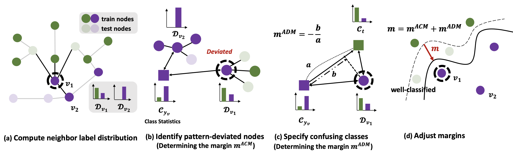

# TAM: Topology-Aware Margin Loss for Class-Imbalanced Node Classification

## Introduction

Official Pytorch implementation of ICML 2022 paper "[TAM: Topology-Aware Margin Loss for Class-Imbalanced Node Classification](https://proceedings.mlr.press/v162/song22a)"


This work investigates the phenomenon that imbalance handling algorithms for node classificaion excessively increase the false positives of minor classes.
To mitigate this problem, we propose TAM, which adjusts the margin of each node according to the deviation from class-averaged topology.

## Semi-Supervised Node Classification (Public Split)

The code for semi-supervised node classification. 
This is implemented mainly based on [Pytorch Geometric](https://github.com/rusty1s/pytorch_geometric).

- Running command for TAM:
  1. Balanced Softmax + TAM
    ```
    python main_bs.py --tam \
    --loss_type bs \
    --dataset [dataset] \
    --net [net] \
    --n_layer [n_layer] \
    --feat_dim [feat_dim] \
    --tam_alpha [tam_alpha] \
    --tam_beta [tam_beta] \
    --temp_phi [temp_phi] \
    ```

- Running command for baselines:
  1. Cross Entropy
    ```
    python main_bs.py \
    --loss_type ce \
    ```
  2. Re-Weight
    ```
    python main_rw.py --reweight \
    --loss_type ce \
    ```
  3. PC Softmax
    ```
    python main_pc.py --pc_softmax \
    --loss_type ce \
    ```
  4. Balanced Softmax
    ```
    python main_bs.py \
    --loss_type bs \ 
    ```

- Argument Description
  1. Experiment Dataset (the dataset will be downloaded automatically at the first running time):\
       Set [dataset] as one of ['Cora', 'Citeseer', 'PubMed', 'chameleon', 'squirrel', 'Wisconsin']
  2. Backbone GNN architecture:\
       Set [net] as one of ['GCN', 'GAT', 'SAGE']
  3. The number of layer for GNN:\
       Set [n_layer] as one of [1, 2, 3]
  4. Hidden dimension for GNN:\
       Set [feat_dim] as one of [64, 128, 256]
  5. The strength of ACM, α:\
       Set [tam_alpha] as one of [0.5, 1.5, 2.5]
  6. The strength of ADM, β:\
       Set [tam_beta] as one of [0.25, 0.5]
  7. The class-wise temeperature hyperparameter, 𝜙: \
       Set [temp_phi] as one of [0.8, 1.2]

We will update ReNode and GraphENS later.

## Dependencies
This code has been tested with 
- Python == 3.8.0
- Pytorch == 1.8.0
- Pytorch Geometric == 2.0.1
- torch_scatter == 2.0.8

## Citation
```

@InProceedings{pmlr-v162-song22a,
  title = 	 {{TAM}: Topology-Aware Margin Loss for Class-Imbalanced Node Classification},
  author =       {Song, Jaeyun and Park, Joonhyung and Yang, Eunho},
  booktitle = 	 {Proceedings of the 39th International Conference on Machine Learning},
  pages = 	 {20369--20383},
  year = 	 {2022},
  volume = 	 {162},
  series = 	 {Proceedings of Machine Learning Research},
  month = 	 {17--23 Jul},
  publisher =    {PMLR},
}

```
